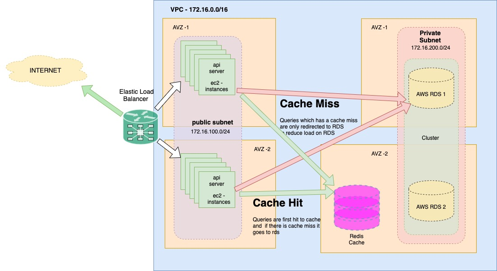

### AWS architecture for api server

#Description

All the application server will be deployed on to ec2-instances placed in public subnet
across different availability zone to ensure disaster recovery. 

Database server are kept in private subnet to ensure security. They are placed as cluster
to ensure high availability with one as  primary write db and second as active replica of 
primary db

We have also placed a cache to ensure we serve our request faster and also to have less reads
for more frequent data on the database server

We can place a S3 to store our data file, However that part is not depicted in diagram 

# MicroService based Architecture 

We can deploy our stack on container using orchestartor on the VM's to ensure uniform deployment
easy maintainability, quick deployment 
